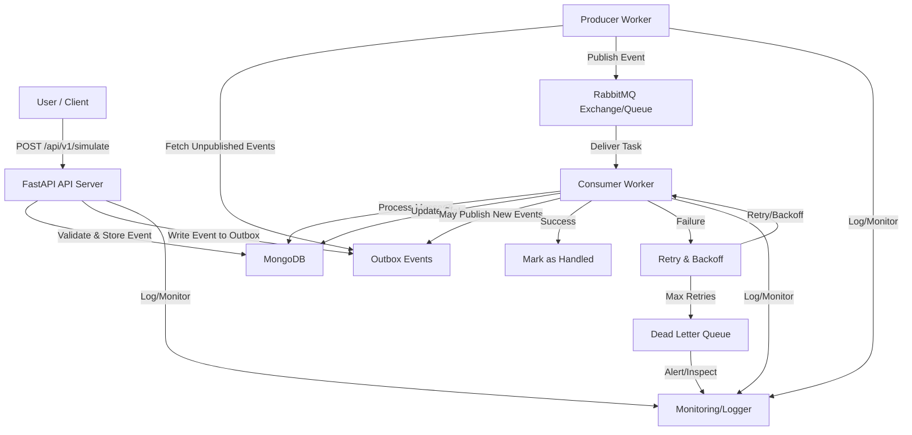

# NetworkSimulationServer

A scalable, asynchronous backend for simulating network topologies in parallel. Built with **FastAPI**, **MongoDB**, and **RabbitMQ**, it enables research, testing, and educational use by supporting distributed, robust, and modular network simulation.

---

## 🚀 Project Goal

Simulate multiple network topologies concurrently, with full lifecycle management, validation, and observability. The system is designed for extensibility, reliability, and high throughput.

---

## 🏗️ High-Level Architecture

- **API Layer ([app/api](app/api/README.md))**: FastAPI endpoints for simulation management, data retrieval, and debugging. Handles validation, dependency injection, and error handling.
- **Business Logic ([app/business_logic](app/business_logic/README.md))**: Orchestrates simulation and link execution, validation, and transactional workflows.
- **Data Access ([app/db](app/db/README.md))**: MongoDB CRUD, transactions, and indexing for events, topologies, and simulations.
- **Message Broker ([app/messageBroker](app/messageBroker/README.md))**: RabbitMQ-based event-driven communication, with robust producer/consumer abstractions and backpressure management.
- **Workers ([app/workers](app/workers/README.md))**: Scalable background processes for event production and consumption.
- **Models ([app/models](app/models/README.md))**: Pydantic models, enums, and mapping utilities for type-safe data flow.
- **Utils ([app/utils](app/utils/README.md))**: Logging, error handling, system info, and helper functions.
- **Deployment ([k8s](k8s/README.md))**: Kubernetes manifests and scripts for production and local deployment.

---

## 📦 Directory Structure

```
├── app/
│   ├── api/           # FastAPI route definitions
│   ├── business_logic/ # Core simulation and link logic
│   ├── db/            # Database access and models
│   ├── models/        # Pydantic models and schemas
│   ├── messageBroker/ # RabbitMQ producers/consumers
│   ├── utils/         # Utility modules (logger, error handler, etc.)
│   ├── workers/       # Worker scripts for background processing
│   └── monitoring/    # Monitoring and observability
├── k8s/               # Kubernetes manifests and deployment scripts
├── deployment/        # Docker, docker-compose, and deployment configs
├── examples/          # Example simulation input files
├── tests/             # Test suite
├── visual/            # Visualization scripts
├── main.py            # Entrypoint for API server
├── requirements.txt   # Python dependencies
└── ...
```

---

## 🔄 Full System Process Flow

Below is a detailed visualization of the end-to-end process, including retries, DLQ, and monitoring:



**Key Details:**
- **Outbox Pattern:** Events are only published if successfully stored in the DB, ensuring reliability.
- **Producer Workers:** Fetch unpublished events from the outbox, serialize, and publish to RabbitMQ.
- **Consumer Workers:** Process messages, update simulation/link state, and may trigger further events.
- **Retries & Backoff:** Consumers retry failed tasks with exponential backoff; after max retries, messages go to the DLQ.
- **DLQ:** Dead Letter Queue for failed messages, with monitoring and alerting.
- **Monitoring:** Centralized logging and error tracking at every stage.

---

## 🧩 Module Summaries

- **API Layer:** RESTful endpoints, validation, error handling, and dependency injection. [Details](app/api/README.md)
- **Business Logic:** Simulation orchestration, link execution, validation, and transactional workflows. [Details](app/business_logic/README.md)
- **Data Access:** MongoDB CRUD, transactions, and indexing. [Details](app/db/README.md)
- **Message Broker:** RabbitMQ management, producer/consumer abstractions, backpressure, and DLQ. [Details](app/messageBroker/README.md)
- **Workers:** Scalable background processes for event production and consumption. [Details](app/workers/README.md)
- **Models:** Pydantic models, enums, and mapping utilities. [Details](app/models/README.md)
- **Utils:** Logging, error handling, system info, and helpers. [Details](app/utils/README.md)
- **Deployment:** Kubernetes manifests and scripts for production/local deployment. [Details](k8s/README.md)

---

## 🧑‍💻 Quickstart

### 1. **Docker Compose (Recommended)**

```bash
cd deployment
# Edit .env if needed (see Configuration below)
docker-compose up --build
```
- API: [http://localhost:9090](http://localhost:9090)
- API Docs: [http://localhost:9090/docs](http://localhost:9090/docs)
- RabbitMQ UI: [http://localhost:15672](http://localhost:15672) (guest/guest)
- MongoDB: port 27017

### 2. **Manual (Local Python)**

```bash
git clone <repo-url>
cd NetworkSimulationServer
python -m venv venv
source venv/bin/activate  # or venv\Scripts\activate on Windows
pip install -r requirements.txt
# Set environment variables (see Configuration)
python main.py
```

---

## ⚙️ Configuration

Set via environment variables (see `app/config/base.py`). Example:

```
MONGODB_URI=<your-mongodb-uri>
MONGODB_DB=network_sim_db
RABBITMQ_URL=<your-rabbitmq-url>
```

You can override these in `deployment/docker-compose.yml` or with a `.env` file.

---

## 📚 Simple API Usage

### 1. Create a Simulation

**Endpoint:** `POST /api/v1/simulate`

**Example Request Body:** ([examples/single_simulation_single_link.json](examples/single_simulation_single_link.json))

```json
[
    {
        "topology": {
            "nodes": ["A", "B"],
            "links": [
                { "from_node": "A", "to_node": "B", "latency": 2 }
            ]
        },
        "config": {
            "duration_sec": 60,
            "packet_loss_percent": 0.1,
            "log_level": "info"
        }
    }
]
```

**Curl Example:**
```bash
curl -X POST http://localhost:9090/api/v1/simulate \
  -H "Content-Type: application/json" \
  -d @examples/single_simulation_single_link.json
```

---

### 2. Get Simulation Status

**Endpoint:** `GET /api/v1/simulation-data/status/{simulation_id}`

**Curl Example:**
```bash
curl http://localhost:9090/api/v1/simulation-data/status/<simulation_id>
```

---

### 3. Get Simulation Details

**Endpoint:** `GET /api/v1/simulation-data/get-simulation/{simulation_id}`

**Curl Example:**
```bash
curl http://localhost:9090/api/v1/simulation-data/get-simulation/<simulation_id>
```

---

### 4. Simulation Actions

- **Restart:** `POST /api/v1/restart/{simulation_id}`
- **Pause:**   `POST /api/v1/pause/{simulation_id}`
- **Resume:**  `POST /api/v1/resume/{simulation_id}`
- **Edit:**    `PUT  /api/v1/edit/{simulation_id}`

**Curl Example (Restart):**
```bash
curl -X POST http://localhost:9090/api/v1/restart/<simulation_id>
```

---

## 🧪 Examples & Visualization

- Example simulation requests: [`examples/`](examples/)
- Topology visualization: [`visual/nx.py`](visual/nx.py) (uses NetworkX & Matplotlib)

---

## 🛠️ Contributing

1. Fork and clone the repo
2. Create a new branch for your feature or bugfix
3. Make changes and add tests
4. Open a pull request

---

## 📄 License

MIT License. See `LICENSE` (add your license file if missing).

---

## 📬 Contact

- Issues: [GitHub Issues](https://github.com/eliitzh17/NetworkSimulationServer/issues)
- Discussions: [GitHub Discussions](https://github.com/eliitzh17/NetworkSimulationServer/discussions)
- Email: <your.email@example.com>

---

## 🗺️ Roadmap / TODO

- [ ] Add more tests (unit, integration, E2E)
- [ ] Enhance monitoring and alerting
- [ ] Improve validation and error handling
- [ ] Add dashboards for simulation results and system metrics
- [ ] Support for more network protocols and topologies

---

> _Built with ❤️ for scalable, parallel network simulation._ 