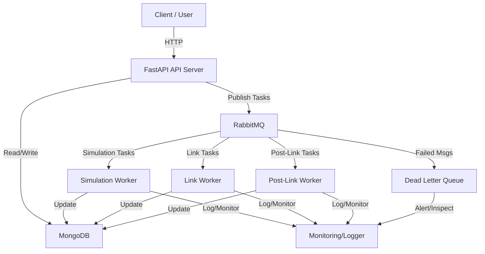

# Network Simulation Server

[](https://github.com/eliitzh17/NetworkSimulationServer/actions/workflows/ci.yml)
[](LICENSE)

---

## Objective

A scalable backend for managing and simulating network topologies. Built with FastAPI, MongoDB, and RabbitMQ, it supports distributed simulation, robust validation, and modular architecture for research, testing, and educational use.

---

## Quickstart

```bash
git clone https://github.com/your-org/network-simulation-server.git
cd network-simulation-server
cp .env.example .env  # Edit as needed
cd deployment
docker-compose up --build
```

- Visit [http://localhost:9090/docs](http://localhost:9090/docs) for API docs.

---

## Table of Contents

- [Architecture](#architecture)
- [Component Roles](#component-roles)
- [Application Flow](#application-flow)
- [Validation](#validation)
- [Logger & Monitoring](#logger--monitoring)
- [Dependency Injection](#dependency-injection)
- [Configuration](#configuration)
- [Running the Project](#running-the-project)
- [API Overview](#api-overview)
- [Examples](#examples)
- [Development & Contributing](#development--contributing)
- [License](#license)
- [Contact](#contact)

---

## Architecture

The system is modular and service-oriented for scalability and maintainability.

### Main Components

- **API Server (FastAPI):** Handles HTTP requests, exposes RESTful endpoints, coordinates simulation tasks.
- **Workers:** Background processes for simulation and link execution, communicating via RabbitMQ.
- **MongoDB:** Stores simulation data, metadata, and results.
- **RabbitMQ:** Message broker for decoupling and distributing simulation and link processing tasks.
- **Monitoring:** Centralized logging and error tracking.

### Architecture Diagram



### Directory Structure

```
├── app/
│   ├── api/           # FastAPI route definitions
│   ├── business_logic/ # Core simulation and link logic
│   ├── db/            # Database access and models
│   ├── models/        # Pydantic models and schemas
│   ├── bus_messages/  # RabbitMQ publishers/consumers
│   ├── utils/         # Utility modules (logger, error handler, etc.)
│   ├── workers/       # Worker scripts for background processing
│   └── monitoring/    # Monitoring and observability
├── deployment/        # Docker, docker-compose, and deployment configs
├── examples/          # Example simulation input files
├── tests/             # Test suite
├── visual/            # Visualization scripts (see below)
├── main.py            # Entrypoint for API server
├── run_all.py         # Entrypoint to run API and all workers
├── config.py          # Configuration and environment variable handling
├── requirements.txt   # Python dependencies
├── README.md          # Project documentation
└── ...
```

---

## Component Roles

- **API Server:** Receives client requests, validates input, stores/retrieves data from MongoDB, and dispatches simulation tasks to RabbitMQ.
- **Workers:** Listen to RabbitMQ queues, process simulation or link tasks, and update MongoDB with results.
- **MongoDB:** Central data store for all simulation-related information.
- **RabbitMQ:** Ensures reliable, asynchronous task distribution between the API and workers.
- **Monitoring:** Logs errors, state changes, and supports alerting for failed tasks (DLQ).

---

## Application Flow

1. **Simulation Creation**
   - Client sends a request to create a simulation via the API.
   - API validates, stores in MongoDB, and publishes a message to RabbitMQ.
   - API returns simulation ID(s) to the client.
2. **Simulation Worker**
   - Consumes simulation tasks from RabbitMQ.
   - Updates simulation state, publishes link tasks for each link.
3. **Link Worker**
   - Consumes link tasks, validates, simulates latency, and publishes post-link tasks.
4. **Post-Link Worker**
   - Updates simulation metadata, checks for completion, and updates state.
5. **Monitoring & DLQ**
   - All errors and failed messages are logged and, if necessary, moved to the Dead Letter Queue for inspection and alerting.

---

## Validation

Validation is performed before and after actions to ensure data integrity:

- **Pre-action:** Node existence, link validation, latency checks, simulation state.
- **Post-action:** Packet loss, timeouts, completion checks.

---

## Logger & Monitoring

- Centralized logging using Loguru (see `app/utils/logger.py`).
- Each component/module uses a named logger for traceability.
- Monitoring and alerting for failed tasks and system health.

---

## Dependency Injection

- Managed via `app/api/dependencies.py`.
- Provides MongoDB and RabbitMQ clients to API routes and workers.
- Ensures clean resource management and testability.

---

## Configuration

Set via environment variables (see `.env.example`). Key variables:

```env
MONGODB_URI=...
MONGODB_DB_DEV=network_sim_db_dev
MONGODB_DB_PROD=network_sim_db_prod
RABBITMQ_URL=...
ENV=dev  # or 'prod'
```

---

## Running the Project

**With Docker:**

```bash
cd deployment
docker-compose up --build
```

- API: [http://localhost:9090](http://localhost:9090)
- API Docs: [http://localhost:9090/docs](http://localhost:9090/docs)
- RabbitMQ UI: [http://localhost:15672](http://localhost:15672) (guest/guest)
- MongoDB: port 27017

---

## API Overview

- **POST /api/simulate**: Create new simulations
- **POST /api/restart/{simulation_id}**: Restart a simulation
- **POST /api/pause/{simulation_id}**: Pause a simulation
- **POST /api/stop/{simulation_id}**: Stop a simulation
- **PUT /api/edit/{simulation_id}**: Edit a simulation
- **GET /api/simulation-data/status/{simulation_id}**: Get simulation status
- **GET /api/simulation-data/get-simulation/{simulation_id}**: Get simulation details
- **GET /api/simulation-data/get-all-simulations**: List all simulations
- **POST /api/debug/send-simulation-message**: Send a simulation message
- **GET /api/debug/ping**: Debug health check
- **GET /health**: Service health

See `/docs` for full interactive API documentation.

---

## Examples

- Example simulation requests and topologies: `examples/`
- Topology visualization: see `visual/nx.py` (uses NetworkX and Matplotlib to render bus, star, ring, mesh, tree, hybrid, and point-to-point topologies)

---

## Development & Contributing

1. Fork and clone the repo
2. Create a new branch for your feature or bugfix
3. Make changes and add tests
4. Open a pull request

See `CONTRIBUTING.md` for details.

---

## License

MIT License. See [LICENSE](LICENSE).

---

## Contact

- Issues: [GitHub Issues](https://github.com/eliitzh17/NetworkSimulationServer/issues)
- Discussions: [GitHub Discussions](https://github.com/eliitzh17/NetworkSimulationServer/discussions)
- Email: <your.email@example.com>

---

## What's Next?

- [ ] Add more tests (unit, integration, E2E)
- [ ] Enhance monitoring and alerting
- [ ] Improve validation and error handling
- [ ] Add dashboards for simulation results and system metrics
- [ ] Support for more network protocols and topologies
